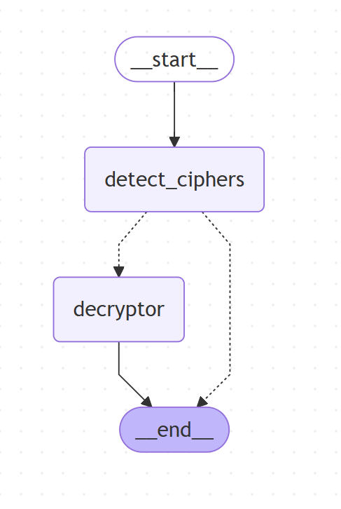

# Cipher Whisperer

## Overview

Cipher Whisperer is a software project that aims to decrypt and analyze cipher texts using a graph-based approach. The project utilizes various software libraries and tools to process and transform the input text.

Graph Architecture:

## Software and Libraries Used

* Python 3 as the primary programming language
* `dotenv` for environment variable management
* `langgraph` for graph-based processing and transformation
* `langchain_core` and `langchain_openai` for natural language processing and AI-powered decryption
* `pydantic` for data validation and parsing

## Decryptors

The project features a range of decryptors, including:

* BruteForceDecryptor: a brute-force decryptor that uses a list of English words to decrypt Caesar ciphers
* Other decryptors (to be added in future updates)

## Getting Started

### Prerequisites

* Python 3
* Required libraries: `dotenv`, `langgraph`, `langchain_core`, `langchain_openai`, `pydantic`

### Installation

1. Clone this repository.
2. Create a virtual environment.
3. Install the required libraries: `pip install -r requirements.txt`
4. Create a `.env` file with your environment variables (i.e. API keys) following the `.env.example` file

### Running the Code

1. Run the main script: `python main.py`
2. Follow the prompts to input a cipher text and receive the decrypted output

## Project Structure

* `cipherwhisperer/`: main project directory
	+ `main.py`: entry point for the project
	+ `graph.py`: graph-based processing and transformation of input text
	+ `chains.py`: chain-based processing and transformation of input text
	+ `models.py`: data models for the project (e.g. `GraphState`)
	+ `decryptors.py`: decryptor implementations (e.g. BruteForceDecryptor)
	+ `.gitignore`: ignore file for Git

## Contributing

Contributions are welcome! Please submit a pull request with your changes and a brief description of what you've added or fixed.

## License

This project is licensed under the MIT License. See `LICENSE` for details.

## Reference
1. Yuan, Y., Jiao, W., Wang, W., Huang, J., He, P., Shi, S., & Tu, Z. (2024). GPT-4 Is Too Smart To Be Safe: Stealthy Chat with LLMs via Cipher. In The Twelfth International Conference on Learning Representations [Link Here](https://openreview.net/forum?id=MbfAK4s61A). 